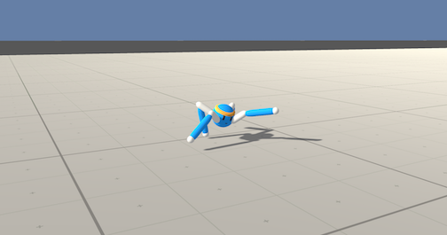

# About
Training a 4 legged agent to walk in Crawler Unity Environment

## Crawler Unity Environment

* Set-up: A creature with 4 arms and 4 forearms.
* Goal: The agents must move its body toward the goal direction without falling.
  * `CrawlerStaticTarget` - Goal direction is always forward.
  * `CrawlerDynamicTarget`- Goal direction is randomized.
* Agents: The environment contains 3 agent linked to a single Brain.
* Agent Reward Function (independent):
  * +0.03 times body velocity in the goal direction.
  * +0.01 times body direction alignment with goal direction.
* Brains: One Brain with the following observation/action space.
  * Vector Observation space: 117 variables corresponding to position, rotation,
    velocity, and angular velocities of each limb plus the acceleration and
    angular acceleration of the body.
  * Vector Action space: (Continuous) Size of 20, corresponding to target
    rotations for joints.
  * Visual Observations: None.
* Reset Parameters: None
* Benchmark Mean Reward: 2000
